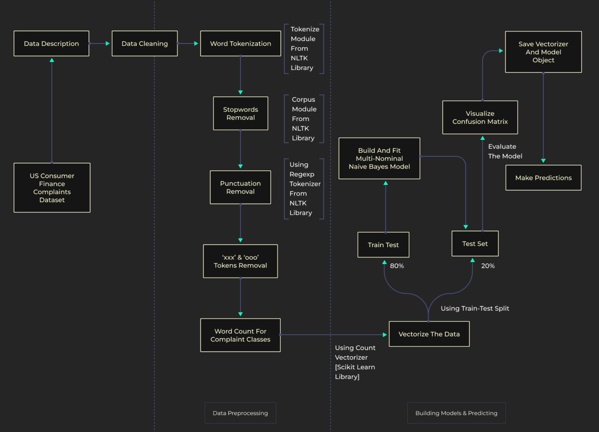

# Multi Class Text Classification Model using Naive Bayes

## Project Overview
### To build a Multi Class Text Classification model when there are more than 2 classes available using Naive Bayes

### Tech Stack - Python | Seaborn | Matplotlib | Sklearn | NTLK
### Steps
